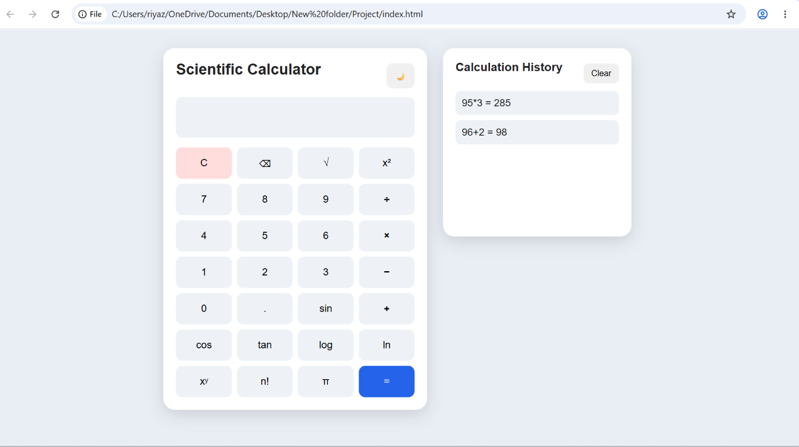

# 🧮 Scientific Calculator

A responsive and professional Scientific Calculator built using HTML, CSS, and JavaScript.

## 🚀 Live Demo

[Click here to use the Scientific Calculator](https://riyazmohammad1420-tech.github.io/Scientific-Calculator/)

## 📸 Screenshot



## ✨ Features

- Basic arithmetic operations
- Addition, subtraction, multiplication and division
- Square root
- Square
- Sin, Cos and Tan
- Logarithm
- Natural logarithm
- Power
- Factorial
- Pi (π)
- Clear and backspace
- Calculation history
- Clear calculation history
- Dark mode
- Light mode
- Keyboard support
- Responsive design
- Mobile friendly
- Error handling
- History stored using Local Storage

## 🛠️ Technologies Used

- HTML5
- CSS3
- JavaScript
- Local Storage

## 📁 Project Structure

```text
Scientific-Calculator/
│
├── index.html
├── style.css
├── script.js
├── README.md
└── screenshots/
    └── calculator.png